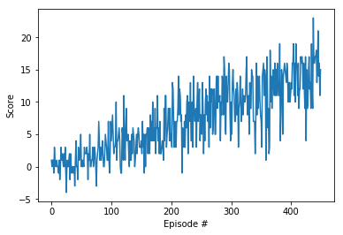
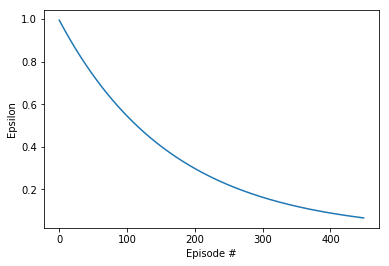

# Udacity deep-reinforcement-learning Navigation project
Navigation problem using Deep Reinforcement Learning Agent

# PROJECT REPORT

Below is described detail of the learning algorithm and the main components:

## Agent

The class `Agent`is the well-known class implementing the following mechanisms:

* Two Q-Networks (local and target) using the a neural network.
* Replay memory (using the class ReplayBuffer)
* Epsilon-greedy mechanism
* Q-learning, i.e., using the max value for all possible actions
* Computing the loss function by MSE loss
* Minimize the loss by gradient descend mechanism using the ADAM optimizer
* Soft update from local QNetwork parameters to target QNetwork parameters

## Model Q-Network

Both Q-Networks (local and target) are implemented by the class `QNetwork`, a simple neural network with 3 fully-connected layers and 2 rectified nonlinear layers. This `QNetwork` class is implemented in the framework of Python package `PyTorch`. The number of neurons of the fully-connected layers are 
as follows:

 * Layer fc1,  number of neurons: _state_size_ x _fc1_units_, 
 * Layer fc2,  number of neurons: _fc1_units_ x _fc2_units_,
 * Layer fc3,  number of neurons: _fc2_units_ x _action_size_,
 
where _state_size_ = 37, _action_size_ = 8, _fc1_units_ and _fc2_units_ are the input params.

## Deep-Q-Network Algoritm

We run several training sessions and we included in `Navigation.ipynb` the best one.  We did that using a `agent` with different parameters and we run the *Deep-Q-Network* procedure `dqn` as follows:

```
  agent = Agent(state_size=state_size, action_size=action_size, seed=1, fc1_units=fc1_nodes, fc2_units=fc2_nodes)       
  scores, episodes epsilon_list = dqn(n_episodes = 1800, eps_start = 1)  
```  

We experience the following parameters:  

* `fc1_units` : Number of nodes for the first fully connected layer.
* `fc2_units` : Number of second for the first fully connected layer.

The obtained weights for the best training session is sabed into the file `model.pt`.

The _Deep-Q-Network_ procedure `dqn` performs  a double loop. External loop is executed till the number of episodes reached the maximal number or the completion criteria is executed `np.mean(scores_window) >=13`, where `scores_window` is the array of the type `deque` realizing  the shifting window of length `<= 100`. The elements `scores_window[i]` and `epsilon_list[i]` contains the `score` and `epsilon` respectively, achieved by the algorithm on the episode `i`.

## Output of training
This is the output of one of our training sessions that indicates, for a given DQN architecture (printed), the number of episodes required to train the model:
```
DQN architecture of the Agent:
QNetwork(
  (fc1): Linear(in_features=37, out_features=50, bias=True)
  (fc2): Linear(in_features=50, out_features=40, bias=True)
  (fc3): Linear(in_features=40, out_features=4, bias=True)
)
Episode: 450, Avg.Score: 13.03,  Score 15.0, Scores >= 13: 59, Epsilon: 0.07
 terminating at episode : 450 ave reward reached +13 over 100 episodes
```
We can plot the evolution of the `score` and `epsilon` during training:





In this example we can check that it is possible to train the agent with 450 episodes usign this neural network architecture for both networks and the hyperparameters used:

```
BUFFER_SIZE = int(1e5)  # replay buffer size
BATCH_SIZE = 64         # minibatch size
GAMMA = 0.99            # discount factor
TAU = 1e-3              # for soft update of target parameters
LR = 5e-4               # learning rate 
UPDATE_EVERY = 4        # how often to update the network


eps_start=.99
eps_end=0.01
eps_decay = .994)
```

# 2. Content of this repository

*  `Navigation.ipynb`: file with fully functional code (all code cells are executed and displaying output).
*  `Report.pdf`: project report.
*   `model.pt`:file with the saved model weights of the successful agent.
